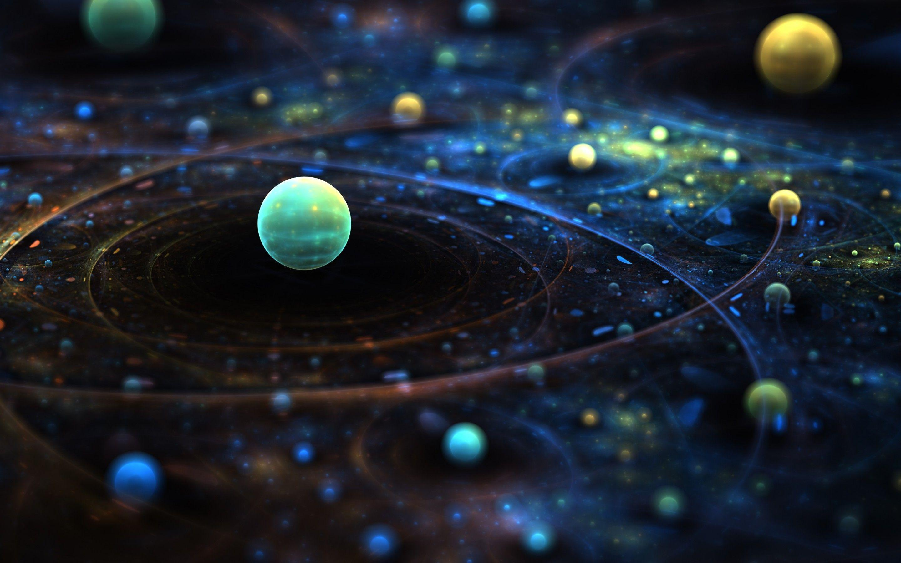
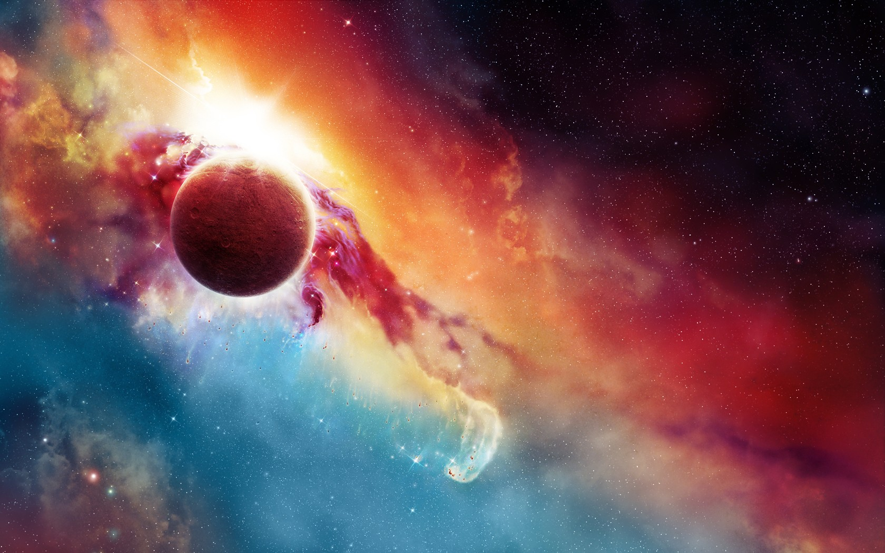
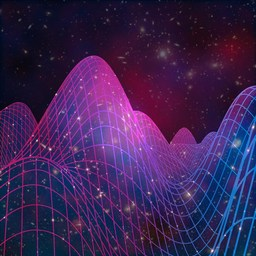
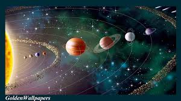
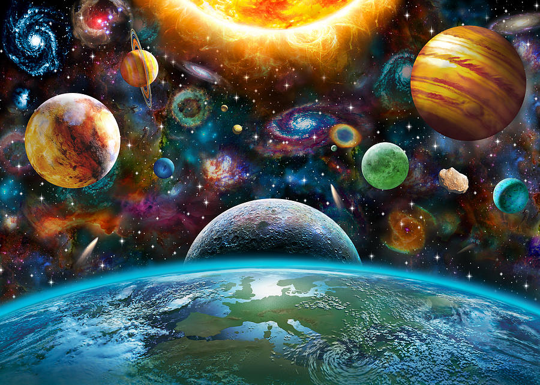
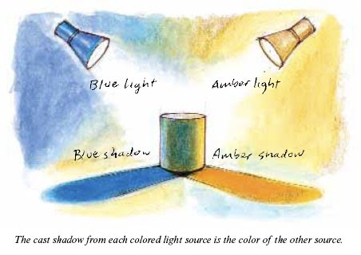
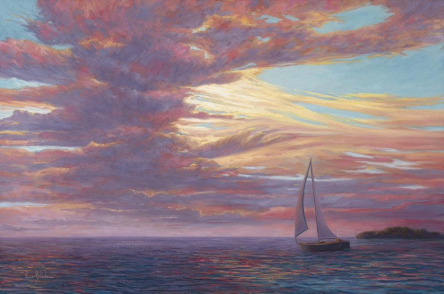
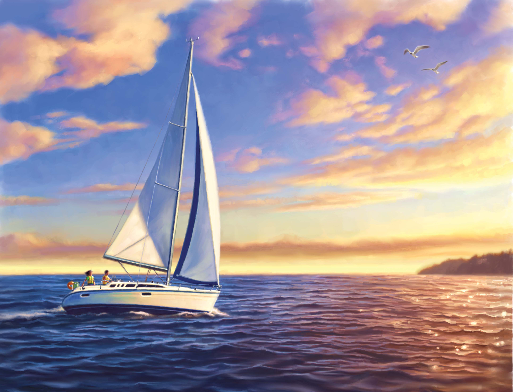

# Art of Oil Painting :thinking:

This ReadME.MD file is to highlight the material written in Light & Shadows, a recent book I've written about Science in Oil Painting. :dog:

## The content reviewed in that sheet are listed below:

- Physics of The Universe
- Universe, Solar System & Light Travel
- Global Maps
- Light & Heat
- Light Through Different Mediums
- Refraction
- Light Through a Prism
- What is Light?
- Shadows
- Rainbows
- Energy Waves
- Electromagnetic Waves
- Light Waves
- Mathematics of Waves
- Einstein thoughts about Light
- What is Color?
- Musical Nautilus
- Beyond Colors

## Additional material learned within the current period, we have the introduction of:

- Art Concepts :heart:
  - Geometry, Materials, Structures, Dynamics & Movement.
- Painting Layers :cat:
  - Defining Boundaries
  - Ratios & Other Math Terms
  - Visualizing Between the Lines
- Painting
  - Ideal Material Organizing Setup
  - From lines to backgrounds
  - Mixing Colors & Keeping Good Balance
  - System of Colors
  - Transparency & Glows
  - Mists & Smokes
  - Fine Line Details
  - Textures & Tones
 - Up Keep & Materials Maintenace
    - Stage Ready
    - Materials List
    - About Materials
    - Chemistry of Oil Paint
    - Cleaning Up Oil Paint
 = Notes & Questions
 
## THIS SOUNDS LIKE PHYSICS :star:

- For many year man qestioned how does all around us exist?

- They thought, first there must be a universe.

- How does it look like, we don't really know.

### From the Universe to our Solar System, to our Global System of Coordinates:

- But in our system, and our main guide is the Sun, that shall be our mother coordinate.
- It is our source of heat and light, and without it, much of our experience would never be a word.
- It shines from up above, and through its white light we are allowed to see all that surround us.

Scientists before us have told stories about the nature of light waves, how they travel from their source through a medium, assumed as vacuum for some reason, to the point where it reaches us.

- As weird as it all sounds, it still works. And we collectively experience a reality where all this science capture the world around us and transform into something real.
- So… the sunlight bounces on the moon, and it reflects on the earth, and for whichever reason that light exists when we are turning around some axis, that is somewhat defined by a global system of coordinates.

### What happens to the light rays when it hits the surface of the Earth?

- [Refraction & Optics](IMG0007.jpg)
- [Waves](IMG0008.jpg)
- [Waves Through Different Mediums](IMG0009.jpg)
- [How density affects path of travel](IMG0010.jpg)
- [Rainbow Prism](IMG0011.jpg)

### So What is Light?

\\ Read Book To Find Out //

### End then it turns into light?

- [Colors](IMG00034.jpg)

### And some of it is a shadow?

----------------------------------------------------------------------------
Beyond the colors, then there's the beginning of the world as we experience:
============================================================================

## Understanding the Pieces of The Puzzle: {Art Concepts} 

Our reviews have been centered on understanding the basic mathematics problems, behind art.
- :page_facing_up: [Light & Shadows - Art Book 1](https://github.com/anagouveia1/tutorials/blob/master/Drawing/Light%20%26%20Shadows%20-%20Introduction%20to%20Oil%20Painting.pdf)
- Next material will go over the latest Quiz, while tieing back the idea of what these mathematics are trying to do:

### Reflexes & Mirroring:

- :white_check_mark: [Solving] Can you find what is wrong in this image?

- [MirrorThoughts](IMG0052.jpg)

- :white_check_mark: [Solving] How would you compare the previous image to this one?

- [CoolerIdeas](IMG0053.jpg)

### Pespectives & Reality

- :white_check_mark: [Photography]If this is reality:

- [Allston2017](IMG0054.jpg)

- :white_check_mark: [Canvas]Then this is ___________________________.
- [AllSTONCanvas](IMG0055.jpg)

### Types of Art & Media

- :scroll: [Drawings, Sketches, Water Colors] are all ways of expressing

[In between these two conversion the use of beautiful mathematics to accomplish our operations]

\\ more on the book //

### Don't forget:

- :scroll: More Ideas To Be Included As This Course Progresses

- [Boundaries](IMG0062.jpg)

So long as you are conscious of the different tiny details of good mathematics,
a complete solution will help you get the grade you know you deserve! :point_up:

## Painting Layers:

### So how do we go From a frame to painting?

- [Idea](IMG0064.jpg)
- [Boundary Lines](IMG0065.jpg)

### What's wrong with these two images?

- [Transparency Details](IMG0060.jpg)
- [Boundary Lines](IMG0066.jpg)

### How would you label the following images?

- [Backgrounds & Layers](IMG0079.jpg)
- [Dark or Intense](IMG0072.jpg)
- [Dynamics & Movement](IMG0093.jpg)
- [Bright Wonderland](IMG0074.jpg)
- [Foxy Lady](IMG0075.jpg)
- [Smokey Details](IMG0078.JPG)
- [Bright Escape](IMG0077.jpg)
- [Landscape](IMG0082.jpg)
- [Birds](IMG0084.jpg)
- [Boats](IMG0085.jpg)

<Goal>

- [Sail Boat](IMG0087.jpg)
- [Lion](IMG0088.jpg)
- [Dawg](IMG0092.jpg)

## MATERIAL IDEAS:

- :book: [Art Area Set Up](IMG0067.JPG)

- :page_facing_up: [Get SKETCHES](IMG0068.jpg)
- :movie_camera: [PROJECTIONS](IMG0069.jpg)

- :book: [Brushes]

---

### Last Remarks:

:point_up: *These are resources I can recommend to every student regardless of their skill level or tech stats*

Highly opinionated :bomb:. Mostly backed by science.  
Comes in no particular order :recycle:

U like it? :star: it and [share](https://github.com/anagouveia1?tab=repositories) with a friendly developer! 
U don't like it? [Watch the doggo](https://twitter.com/RespectfulMemes/status/900147758845308930) :dog:

*P.S. You [don't need to know](https://xkcd.com/1050/) all of that by heart to be a programmer.  
But knowing the stuff will help you become better! :muscle:*
